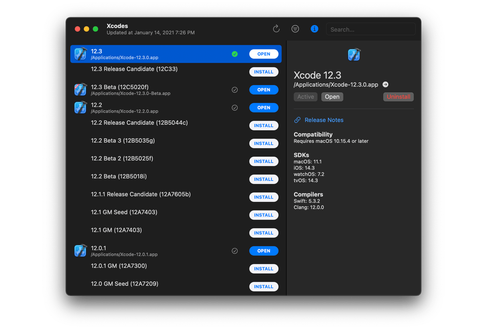

<h1> Xcodes.app</h1>

The easiest way to install and switch between multiple versions of Xcode.

_If you're looking for a command-line version of Xcodes.app, try [`xcodes`](https://github.com/RobotsAndPencils/xcodes)._




## Features

- List all available Xcode versions from [Xcode Releases'](https://xcodereleases.com) data or the Apple Developer website.
- Install any Xcode version, fully automated from start to finish. Xcodes uses [`aria2`](https://aria2.github.io), which uses up to 16 connections to download 3-5x faster than URLSession.
- Just click a button to make a version active with `xcode-select`.
- View release notes, OS compatibility, included SDKs and compilers from [Xcode Releases](https://xcodereleases.com).

## Installation

Xcodes.app is currently only provided as source code that must be built using Xcode.

## Development

You'll need macOS 11 Big Sur and Xcode 12 in order to build and run Xcodes.app.

If you aren't a Robots and Pencils employee you'll need to change the CODE_SIGNING_SUBJECT_ORGANIZATIONAL_UNIT build setting to your Apple Developer team ID in order for code signing validation to succeed between the main app and the privileged helper.

Notable design decisions are recorded in [DECISIONS.md](./DECISIONS.md). The Apple authentication flow is described in [Apple.paw](./Apple.paw), which will allow you to play with the API endpoints that are involved using the [Paw](https://paw.cloud) app.

[`xcode-install`](https://github.com/xcpretty/xcode-install) and [fastlane/spaceship](https://github.com/fastlane/fastlane/tree/master/spaceship) both deserve credit for figuring out the hard parts of what makes this possible.

## Releasing a new version

Follow the steps below to build and release a new version of Xcodes.app. For any of the git steps, you can use your preferred tool, but please sign the tag.

```sh
# Update the version number in Xcode and commit the change, if necessary

# Increment the build number
scripts/increment_build_number.sh

# Commit the change
git add Xcodes/Resources/Info.plist
git commit -asm "Increment build number"

# Tag the latest commit
# Replace $VERSION and $BUILD below with the latest real values
git tag -asm "v$VERSION.b$BUILD" "v$VERSION.b$BUILD"

# Push to origin
git push --follow-tags

# Build the app
scripts/package_release.sh

# Notarize the app
# Do this from the Product directory so the app is zipped without being nested inside Product 
pushd Product
../scripts/notarize.sh "test@example.com" "@keychain:altool" MyOrg Xcodes.zip
popd

# Go to https://github.com/RobotsAndPencils/XcodesApp/releases
# Edit the latest draft release
# Set its tag to the tag you just pushed
# Set its title to a string with the format "$VERSION ($BUILD)"
# Polish the draft release notes, if necessary
# Attach the zip that was created in the Product directory to the release
# Publish the release
```

## Contact

<a href="http://www.robotsandpencils.com"></a>

Made with ❤️ by [Robots & Pencils](http://www.robotsandpencils.com)

[Twitter](https://twitter.com/robotsNpencils) | [GitHub](https://github.com/robotsandpencils)
